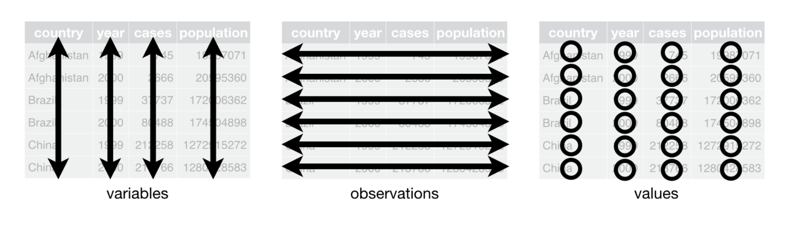

```{r setup, include=FALSE}
knitr::opts_chunk$set(echo = TRUE, message = FALSE)
```


> "Exploratory data analysis can never be the whole story, but nothing else can serve as the foundation stone"^[John Tukey].

#

Son usados para representar variables categóricas y también son útiles para presentar vectores de character en un orden no alfabético.


fct_reorder(): reordena un factor por otra variable
fct_infreq(): reordenar un factor por la frecuencia de los valores
fct_relevel(): cambiar manualmente el orden de los 'levels' de un factor
fct_lump(): combinar los valores con menor/mayor frecuencia de un factor en la categoría "other”.


## Ejemplo: 

A partir de los datos que se presentan a continuación, se presentan varios ejemplos aplicando lo visto anteriormente.

id_hogar   | edad  |
:---------:|------:|
A          | 40    |  
A          | 40    |
A          | NA    |
A          |  3    |
B          | 22    |
B          |  7    |
B          |  4    |

```{r}
library(dplyr)
```

```{r}
tb <- tibble::tibble(id_hogar = c("A", "A", "A", "A", "B", "B", "B"),
                     edad = c(40, 40, NA, 3, 22, 7, 4))
```

```{r}
tb %>% group_by(id_hogar) %>% summarise(nobs1_grupo = n(),
                                        nobs2_group = sum(!is.na(edad)),
                                        nobs_distinct = n_distinct(edad),
                                        first_obs = first(edad),
                                        segunda_obs = nth(edad, 2),
                                        num_child = sum(edad < 10, na.rm = TRUE))
```

A continuación se presenta el número de observaciones por grupo, usando `count()`:

```{r}
tb %>% group_by(id_hogar) %>% count() 
```


# ¿Qué es un *tidy dataset*? 

Un conjunto de datos es *tidy*^[Ver Wickham, H. 2014. Tidy data. Journal of Statistical Software. Vol.59, issue 10 <http://www.jstatsoft.org/v59/i10/paper>.] si:

1. Cada variable debe tener sus propia columna
2. Cada observación debe tener su propia fila
3. Cada valor debe tener su propia celda




Disponer los datos de esta forma facilita el trabajo con éstos, ya que estandariza la organización de los datos.

Para estructurar los datos de esta forma, se pueden usar una serie de funciones disponibles en el paquete `tidyr` que al igual que `dplyr` es parte de *tidyverse*. 

El primer paso de esta etapa es identificar las variables y observaciones. Luego, es importante ver si se tiene alguno de los siguientes problemas:

- Una variable puede estar distribuida en múltiples columnas.
- Una observación puede estar distribuida en varias filas.

Las dos funciones más importantes de `tidyr` para solucionar estos problemas, `pivot_longer()` y `pivot_wider()`, se describen a continuación:

```{r}
library(tidyr)
```

## pivot_longer

Suponga que se dispone de los siguientes datos:

```{r}
zona <- tibble(
  zona = c("A", "B", "C"), 
  `2018` = c(100, 40, 120),
  `2019` = c(110, 60, 115)
)
zona
```

En este caso, las columnas `2018` y `2019` representan valores de la variable `year`, los valores incluidos en dichas columnas son valores de la variable `num_casos` y cada fila contiene dos observaciones. Para llevar los datos a un formato *tidy* usaremos `pivot_longer()`. 

```{r}
zona %>% pivot_longer( 
  cols = -zona, 
  names_to = "year", 
  values_to = "num_casos")
```

## pivot_wider

Suponga que se dispone de los siguientes datos:

```{r}
val <- tibble(
  zona = c("A", "A", "A", "A", "B", "B", "B", "B"), 
  year = c(2019, 2019, 2020, 2020, 2019, 2019, 2020, 2020),
  type = c("varA", "varB", "varA", "varB", "varA", "varB", "varA", "varB"),
  num_casos = c(115, 70, 124, 230, 145, 45, 54, 89)
)
val
```

En este caso, una observación está definida por *zona* y *year* y se encuentra distribuida en 2 filas. Los nombres de las variables están en la columna *type* y los valores en *num_casos*. Para llevar los datos a un formato *tidy* usaremos `pivot_wider()`. 

```{r}
val %>%
    pivot_wider(names_from = type, values_from = num_casos)
```


## separate

Suponga que tiene los siguientes datos: 

```{r}
zona <- tibble::tibble(
  zona = c("A", "B", "C"), 
  rate = c("100/160", "40/75", "120/130")
  )
zona
```

En este caso, la columna *rate* incluye dos variables *num_casos* y *total*, las que se dejarán en columnas separadas usando `separate`. 

```{r}
zona <- zona %>% separate(rate, into = c("num_casos", "total"),
                          convert = TRUE)
zona
```

## unite

`unite` es lo opuesto de `separate`, combinando múltiples columnas en una.

```{r}
zona %>% unite(new, num_casos, total, sep = "/")
```


# Combinando múltiples tablas de datos

Suponga que dispone de dos conjuntos de datos *data1* y *data2*, los cuales se combinarán usando la variable *id* que se denomina *key* y puede ser una o varias variables que identifican una observación y que se usan para conectar los datos de ambas tablas.

```{r}
data1 <- tibble(
  id = c("a", "b", "c", "d"),
  x1 = c(10, 4, 7, 12),
)
data1
```

```{r}
data2 <- tibble(
  id = c("a", "b", "c", "e"),
  x2 = c(3, 5, 13, 9),
)
data2
```

A continuación se describen las siguientes funciones que existen para combinar datos de dos tablas:

- inner_join
- left_join
- right_join
- full_join

## inner_join

Mantiene observaciones que se encuentran en ambas tablas.

```{r}
data1 %>% inner_join(data2, by = "id")
```

## left_join

Mantiene observaciones que se encuentran en la primera tabla.

```{r}
data1 %>% left_join(data2, by = "id")
```

## right_join

Mantiene observaciones que se encuentran en la segunda tabla.

```{r}
data1 %>% right_join(data2, by = "id")
```

## full_join

Mantiene todas las observaciones que se encuentran en cada una de las tablas.

```{r}
data1 %>% full_join(data2, by = "id")
```

Otro tipo de match entre dos tablas de datos que no añade las variables presentes en ambas tablas es la que permiten:

- semi_join
- anti_join

## semi_join

Mantiene las observaciones en *data1* que tienen un match en *data2*

```{r}
data1 %>% semi_join(data2, by = "id")
```

## anti_join

Elimina las observaciones en *data1* que tienen un match en *data2*

```{r}
data1 %>% anti_join(data2, by = "id")
```

## bind_rows

```{r}
data_1 <- tibble::tibble(var1 = c(12,4,5), 
                var2 = c("a", "b", "a"))
data_1
```

```{r}
data_2 <- tibble::tibble(var1 = c(1,6,9,14), 
                var2 = c("b", "b", "a", "b"))
data_2
```

```{r}
data_tot <- dplyr::bind_rows(data_1, data_2)
data_tot
```


